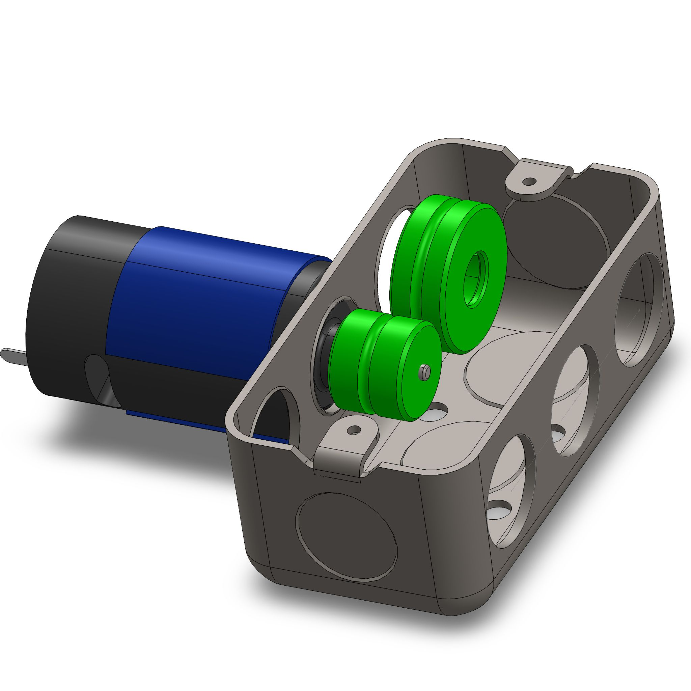
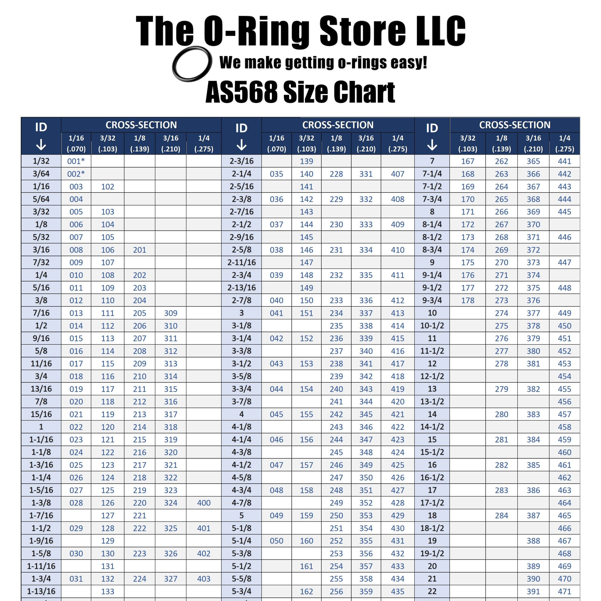
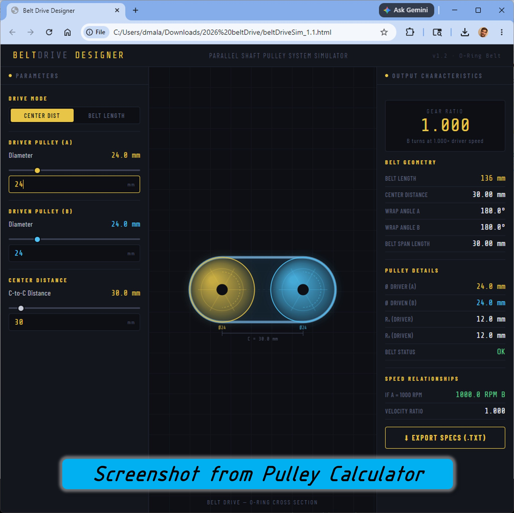

## Configuration
A page for combining and configuring elements of OpenBox

>
> Warning Don't read this page until you're ready!
>
> This page has no singular project or part design.  It's going to describe combinations of openBox related parts that perform functions, for engineers to create their own innovations.  When you have your creative & analytical focus available, this page will burst with new ideas for you!
> 

## Belt Calculator
Implementation of pulleys or toothed belts demands refined positioning of shafts so the round belts install with the proper amount of stretch; the timing belts install with a precise tension.  In 2026 April I formed a belt calculator that replaces a handfull of spreadsheets where we do the following tasks:
* Evaluate the required belt length based on pulley sizes.
* Compute the proper pulley size for 3D printing.
* Match a system configuration to a standard belt length.
* Select o-ring products that are most common and also fit our key geartrains.

* Get the [Belt Design Simulator](docs/beltDriveSim_1.1.html) to try it out.
* Get the [oRing Dash Chart PDF](https://github.com/davidmalawey/openBox/blob/2f49ecf0b632a5d817f5bc2f1ae1fadb6c0556f6/docs/2026_oRingDashChart.pdf) full version of the image below.

_Below, see an example gearbox to be configured.  The green pulley diameters must be selected in conjunction with the belt shape. Next, the HTML based simulator for pulley & belt selection. Right: a chart for o-ring standards based on dash-numbers._
- 
- 
- 
