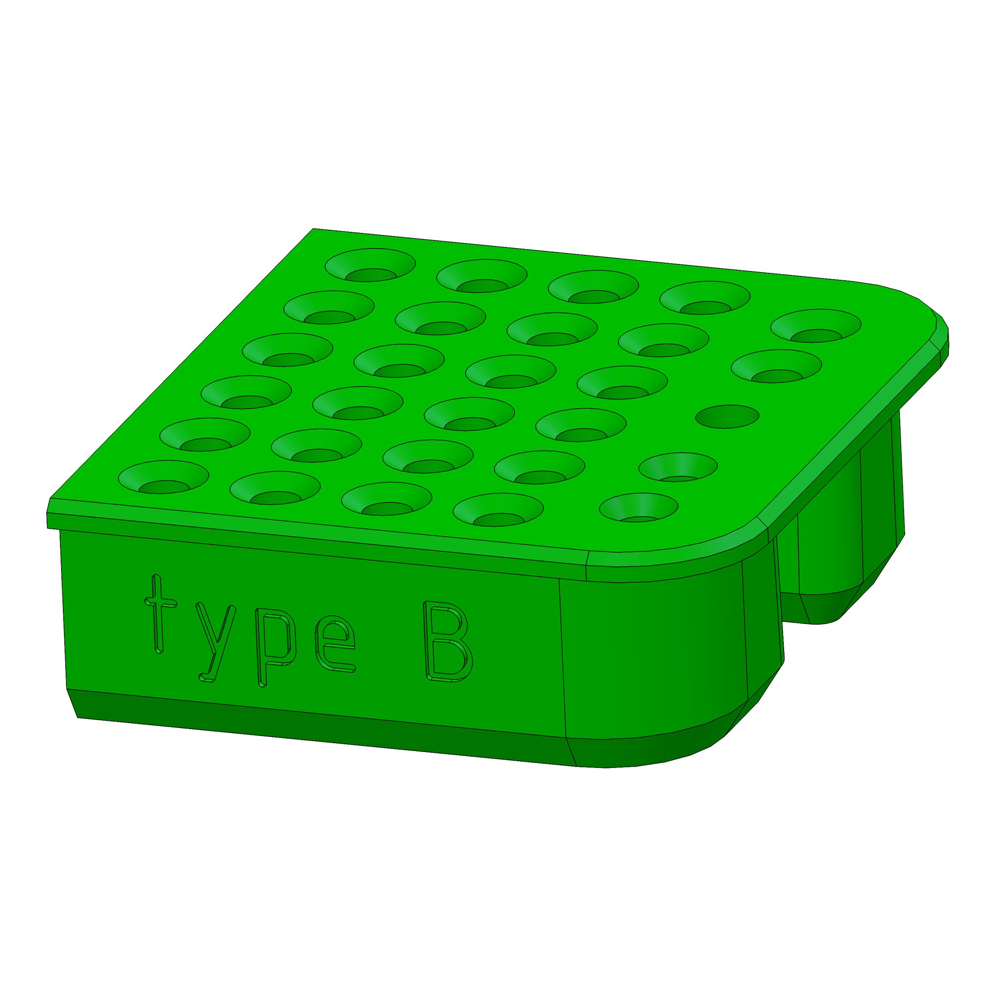
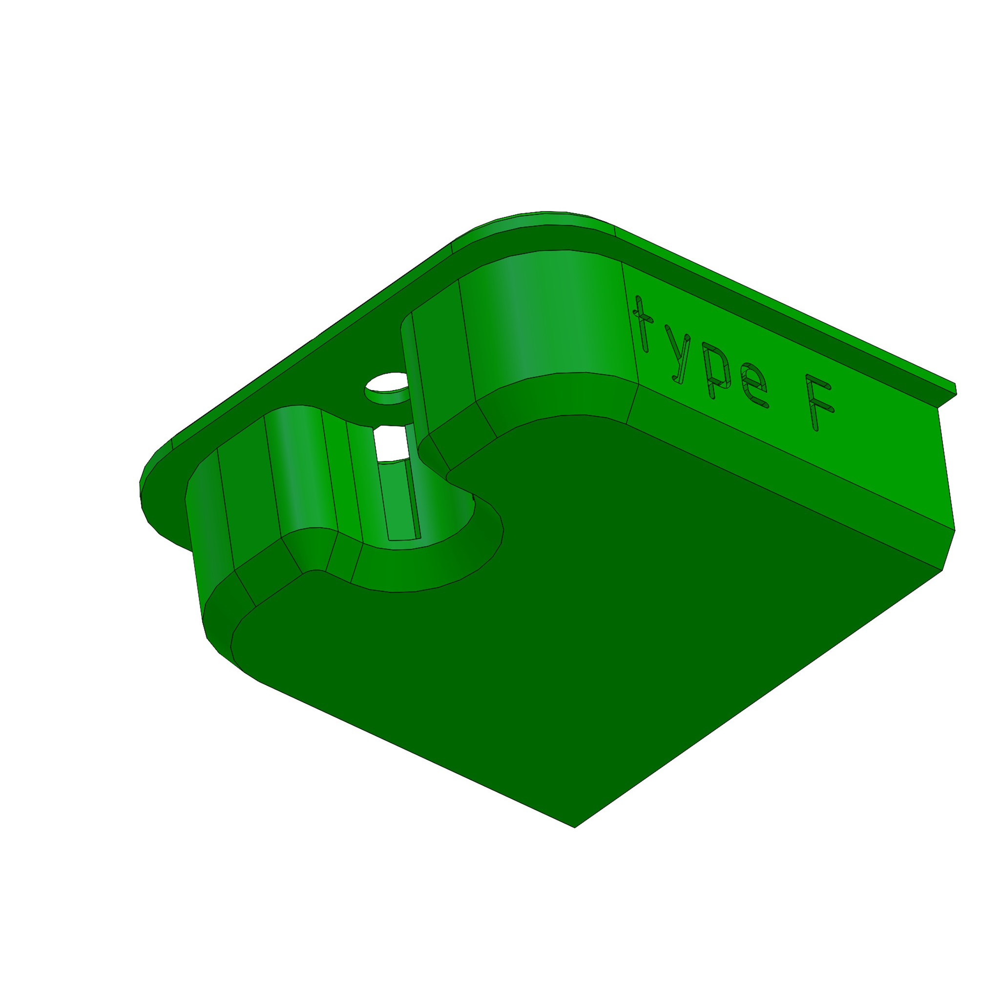

# Designs
The purpose of Handybox is to benefit several types of projects with one standard part, accompanied by several other standards that have a well-established ecosystem and many available components near you at brick-and-mortar stores.
I Hope you benefit from the concepts here - even without building any handybox designs you will find some techniques that save time in CAD, prototyping, wiring, or creating new concepts for designs.

## Videos
To be populated as I create videos to explain features.

**Car Adapter**
This video gives a full tutorial on building the car adapter design which is a combination of many design methods that are reproducible for 10,000 applications.  It discusses the efficiency benefits of the dc adapters, 3d printed interfaces with tolerances and parametric design elements, and much more. 
<iframe width="703" src="https://www.youtube.com/embed/VLrEtrU10ow" title="Build a DIY power supply for powering electronics - using openBox" frameborder="0" allow="accelerometer; autoplay; clipboard-write; encrypted-media; gyroscope; picture-in-picture; web-share" referrerpolicy="strict-origin-when-cross-origin" allowfullscreen></iframe>

See photos below for a clear image of the "car adapter" design using the handybox, 18v power tool battery, silicone wires, and other favorite versatile supplies.

- 
- 
- 

## Features
A technical review for specific engineering features, listed by purpose

## Liner

Easily adjust the box volume with a liner. This addition is made of a foam pad and I call it a "floor liner" and use it to control the height of racked items or protect parts from scatching at the floor of the box. For items standing in the box used as a rack, we can adjust heights without any 3D printing changes.  Alternately, we may want to line the base to prevent contact between brittle metal and the box floor.  This can be achieved in two minutes with some foam or other lining material.  For my example, I wanted to offset the floor for all of the 3rd row taps, due to their short length of shank, they could fall down and become hard to grab.  As needed, just slice a piece of foam or add more layers to offset the height of a row of bits.  Also, this keeps bits from chipping if they drop against the steel box.

 

## Parts
Components, methods, and considerations for organizing wires in projects.  It's best to watch this before you design, so you can discover parts to integrate in your project plans. These are main components around which the other parts are designed.

* EMT Conduit
* Handybox electrical boxes with 1/2in knockout holes
* Switches, 22mm, toggle switches
* Outlets, ordinary 120v North America standard

**Large Box**
The large box is uploaded as a "configuration" of the solidworks model, in grabCAD.  It's a square box, sometimes sold with 4 tabs for 2-gang configuration.

**HandyMount**
Mount your boxes to your DIN rail, multiple orientations & box sizes. This bracket is parametric, with configurations shown in the animated GIF. The narrow option has 1-in spacing for the 1-gang box and the wide option matches the 1.5in spacing of the square boxes found in local stores.

**Bushing**
A feature for electrical and mechanical functions. Version 1 is adapted for fixing anderson connectors into the wall of a panel. It can be adjusted for different hole sizes, or different center features.  You may wish to use it as a grommet, or adapter for a 10mm pushbutton, or 100 other items.  The idea is that a new user gains a new function but retains the investment of the code behind the nicely made parametric part.  The feature tree is easy to navigate, so you may update the design without knowledge of all the original design considerations. (just like open source software).

* 
* 
* 

**Reducer**
This design allows for your choice of machine screw to fasten into the large 22mm holes in the plate steel.  The STEP model features an M6 fastener size with hex nut. But if you access the SOLIDWORKS model you can easily modify it for any size.  The post includes one variation as an example of how to pivot the design for new shapes.  It's designed for a thicker steel with a shorter hoop and a larger M8 bolt. 

- 
- 
- 

The next photos show the reducer used in assembly.  (left) you can pass a 6mm shaft through the reducer and it fits concentric with the original box holes. (right) with a screw and nuts clamping on the reducer, it is ready to withstand additional jobs like an axial load.

- 
- 
- 

**hub**
The hub connects a bearing to the handybox floor, and this design features the octagon shaped box.  All of the large boxes (square and octagon) feature a standard set of holes at the floor which are ready to mount a feature like this.  Use this hub to pass a shaft through the center of the box for a symmetric rotating assembly.
* [get the hub model here](https://grabcad.com/library/hub_0-1])

- 
- 
- 

**Cover**
One model for many purposes.  This model branches into letters A through G so far (2025.10) but I skipped a few that are less common needs.  I produced images for most variants to date.
* cover B fits the small shaft found in all the dremel tools and 1/8 inch rotary devices, an extremely common shank size.
* cover E gives a flat surface sectioned into smaller areas for enhanced printing without warping, in ABS.
* cover E has a second variety with sockets, but it resides in the same .sldprt model as a configuration.
* cover F features hex-shaped holes for insertion of hex driver bits.  The main configuration has a hole depth for the ever-common 1 or 2 inch height of these bits.
* cover J is for holding an instrument panel and features a raised boss, which effectively adds volume to the box.  This particular design fits a DC motor driver and it's expected that many users will have rectangles, for which you can adjust the size with a couple of dimensions.
  
- 
- 
- 
- 
- 
- 
- 
- 
- 
- 

**Octagon**
This variety is modeled after Raco part number 8125, having octagon shape and holes for both 1/2 and 3/4inch conduit, the most common steel conduit sizes.  I made a very clean model in Solidworks for open sourcing.  This abstacts some details and gives the overall shape which is reliable enough to design mating parts.
* Grab CAD for [octagon box](https://grabcad.com/library/octagonbox-1)

_Photos below show the plain octagon box, and integration of a bearing hub.  The hub model is also posted on grabCAD and fits a common 608 bearing with 8mm ID._ 
* 
* 
* 

