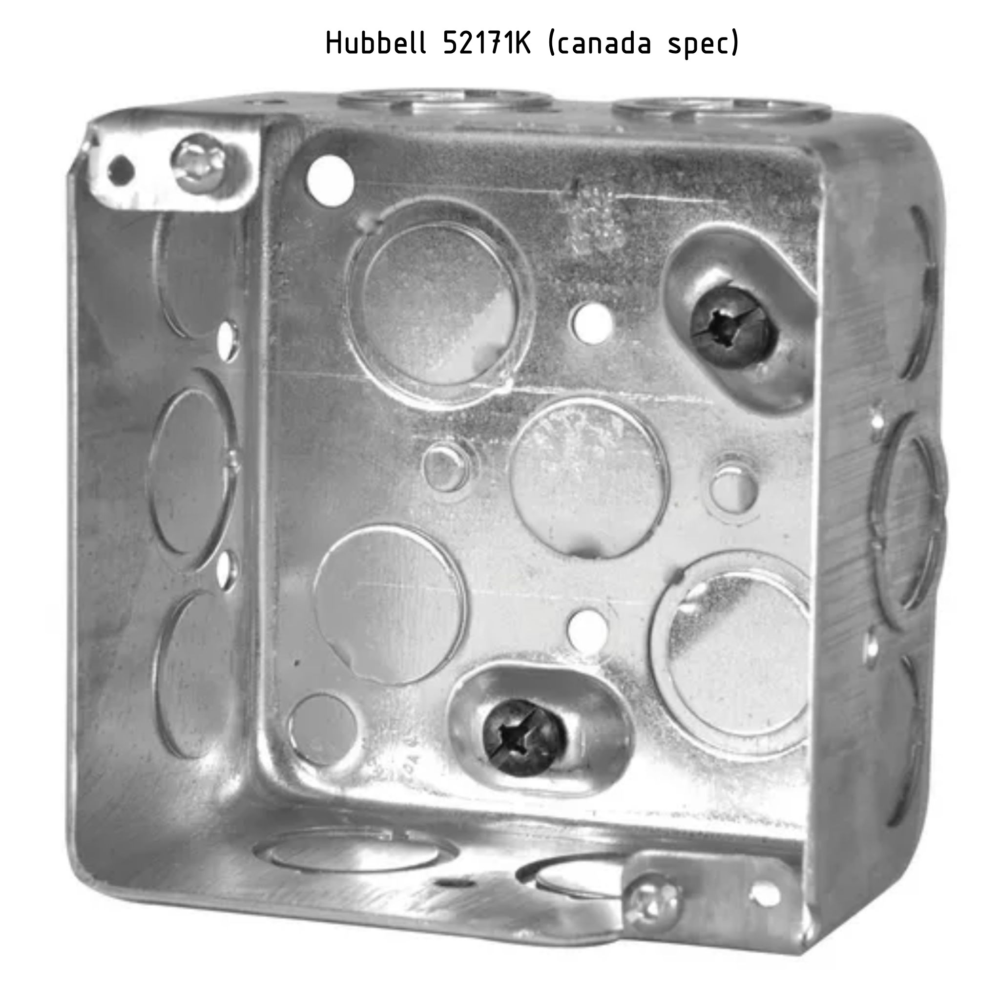
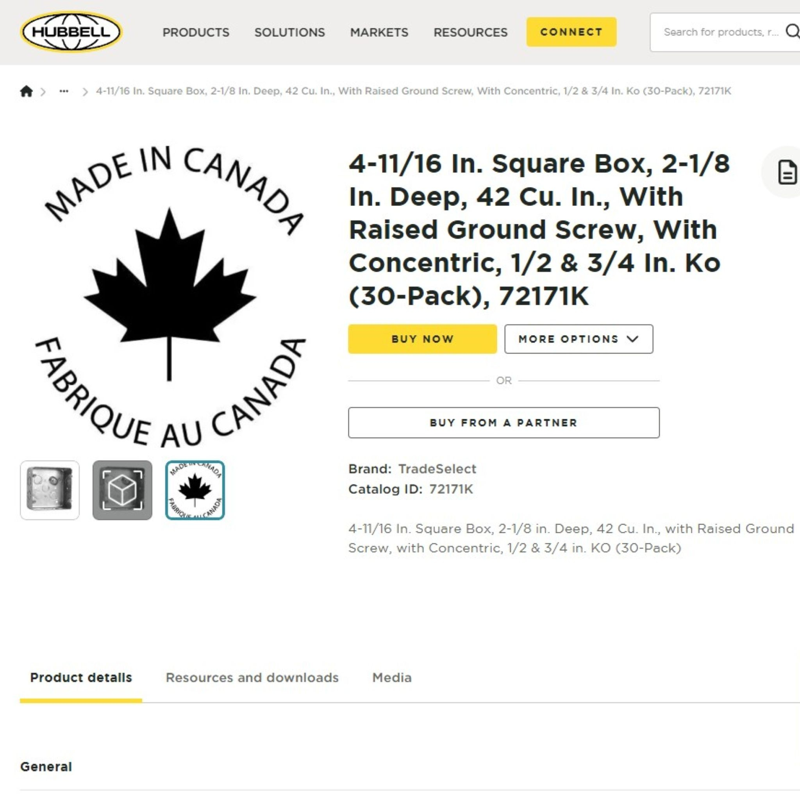

While the "examples" tab focuses on an array of outcomes, this page focuses on the array of source components, array of functions.  It is a backbone for technical designers.

## CAD models
_Links to open source CAD models_

You can find OpenBox-related CAD files by searching [“OpenBox” on GrabCAD](https://grabcad.com/library?page=1&time=all_time&sort=recent&query=openbox) and also on [Thangs](https://thangs.com/designer/bmeunier/collection/OpenBox-97771). Among the results, you’ll discover the original contributions by David Malawey, which include detailed CAD models and essential designs for the OpenBox project. These files serve as the foundation for the project, offering users a reliable starting point for building or customizing their own versions of the OpenBox.

In addition to the original contributions, GrabCAD also features various remixes and adaptations created by the global community. These include innovative modifications, such as HandyBox designs compatible with other countries’ standards, and other creative uses tailored to specific needs.

**Basic Rectangle Box**
The following This widely available component, found in hardware stores across the United States, is specifically designed to be compatible with the OpenBox ecosystem. Along with the CAD files, the library includes data sheets and technical drawings, providing precise dimensions and detailed specifications. These resources ensure accuracy for seamless integration into your projects and offer valuable insights for customization or adaptation to various applications.

* contains datasheet & CAD files
* [handybox post](https://grabcad.com/library/handybox-1) using Raco model 666

**OpenBox Cluster Post**
* see CAD [models post here](https://grabcad.com/library/openbox-1)
* A series of parametric components that utilize the standard construction-grade stamped steel electical conduit boxes, also known as handybox originally made by David Malawey.
* Grab [handybox model here](https://grabcad.com/library/openbox-1)

**eBushing**
This bushing adapts a hole in a panel wall for a connector. It is parametric & the first set of features serves the anderson connector pair, great for power electronics. I called it eBushing for electronics, where the parent model may be later used for mechanical features, but in such a case we will change the compliant design to a different type of fitment, which offers more concentricity to the hole.
* Grab Model for [eBushing here](https://grabcad.com/library/ebushing-1)

**Images**
* 
* 
* 
* 

## Canadian-Spec
* CAD library for canadian parts designs 
* This library is a remix of the original OpenBox project by David Malawey, adapted for the Canadian version of the HandyBox. While the technical requirements closely resemble the original HandyBox designed for the U.S. market, specific differences exist, resulting in slight variations in design. The aim of this library is to replicate key components from David Malawey’s original work, creating a strong foundation for future modifications and applications.

- [OpenBox CEC-Compliant Remix Library (Canadian)](https://grabcad.com/library/openbox-cec-compliant-remix-library-canadian-1)
- Visit [Thangs models here](https://thangs.com/designer/bmeunier/3d-model/OpenBox%20Foundational%20Models-1234009?part=76b5cdc7-514b-4006-83d3-2d162967f113)
- Get [.STEP files on GrabCad](https://grabcad.com/library/openbox-cec-compliant-remix-library-canadian-1]
- Autodesk [Fusion CAD models](https://github.com/dmalawey/openBox/blob/d60093aeba41cf989fe9893492d6be2d1079c27c/data/OpenBox%20Canada-Compliant%20Remix%20Library.f3z)

## Benchmarks
**Catalogs**
It is important for a designer to study existing catalogs, to understand the ecosystem. I've used a couple of catalogs to answer questions like the following:
* is there an existing product that perform **the function** I want?
* from commercial parts, is there **geometry** I should imitate? Can I learn from these parts?
* what portion of the commercial steel part demands steel for my application?  Which design elements are OK for 3D printing? 
* how are the catalogs organized and variations arranged?  Can I learn and borrow decisions for my design array?
* can I discover the highest volume parts via the highlighted catalog parts?  Then, does this inform about which designs are most needed?

Every good design begins with an evaluation stage and benchmarking. If you want to invent something that helps the community, please start with benchmarks.  In the benchmarking process for an OpenBox-related design, start with the catalog & technical drawings below.

## Data
Understand the data provided with commercial parts. This section aims to enable you to perform research quickly and understand the context of various manufacturer-provided documents.  Find simple definitions below, followed by images of samples.

* **sell sheet** is usually a 1-pager with imagery of the application of the product & important specificatons for the customer.
* **customer drawing** is a mechanical drawing which includes relevant specs for _integration_ of the part, rather than _manufacturing_ of the part.
* **spec sheet** is the page for technical information broader than the drawing.  What is the mass? The part series number?
* **catalog page** features the part inside the catalog, along with the part family, variations, and part-number tables.

- 
- 
- 
- 

### Raco Rectangle Box

- 4 in. x 2 in. Handy Box, Drawn, 1-7/8 in. Deep with Seven 1/2 & One 3/4 in. KO's, Raised Ground
- [download (100Mb)](https://lobfile.com/file/TMfW62ny.pdf)

Below, find preview images of the customer drawing, sell sheet, and dimensional drawing. 

*  _see material properties, dimensions, & more_
*  _technical sheets published by manufacturers_
*  _dimensional drawings by manufacturers (Raco & more)_

We don't have a specific structure for posting data but as I accumulate useful drawings and reliable documentation behind the branded boxes (suchas Raco by Hubbel) I will upload the content for others to download.  At times, I markup a PDF with mechanical drawings to point out the key items instead of starting a document from scratch.

## Global
Data for mapping the USA design space to other global specifications

Hubbell is a company that manufactures both USA and Canadian spec designs of boxes.  Reviewing hubbell's design series' can reveal the commonized elements and unique elements between the standard boxes, and inform us where the designs overlap.  Then, we can make more optimal parametric designs. Example questions to answer: can we expect the box thicknesses to match between international specs?  Can we find brands like Raco which have sister brands in other countries?

Below, find two example part numbers (52171k and 72171k) which both satisfy canadian specifciations but feature two different tab styles.  It is possible the main box dimensions are equivalent between USA and Canada.  Each time you perform research for your own design, it may add value to summarize this research & share in OpenBox Project.
- 
- 
- 
