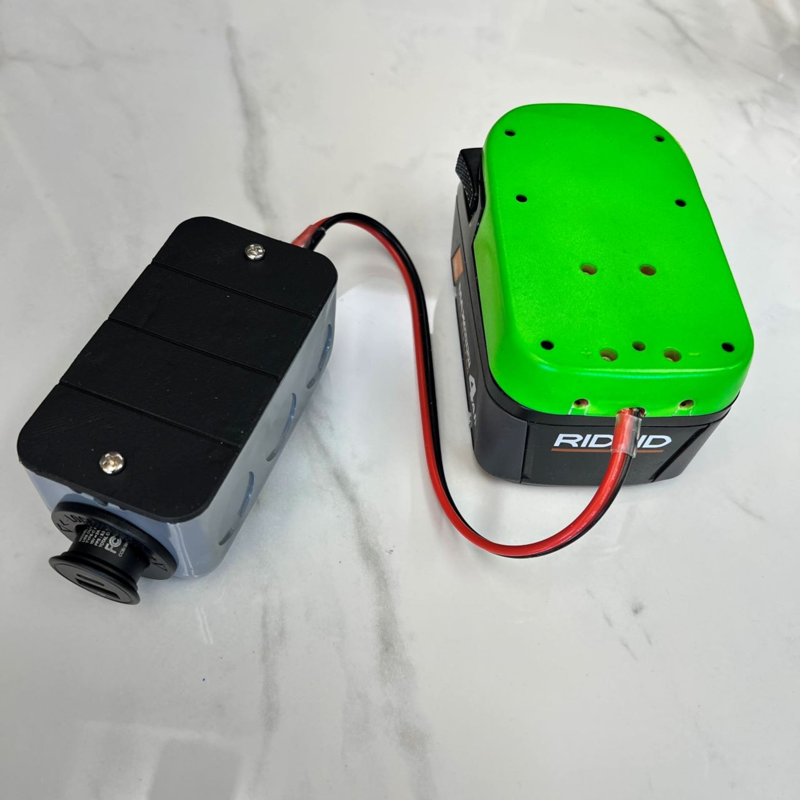

# Examples

>
> Looking for inspiration or practical examples of how to use OpenBox? Start here!
>

This gallery showcases a variety of examples, including designs and configurations, to help you get started. Some examples are fully documented, while others provide a visual overview for quick reference. The gallery is regularly updated as new items are created and shared.

### Get Started:
_steps to get you started in designing_
1.	**Browse for Ideas**: Explore the gallery to find designs or workflows that match your needs.
2.	**Dive Deeper**: For detailed instructions or configurations, check the linked documentation and other sections.
3.	**Ask Questions**: If you see something in the gallery that isn’t fully documented yet, feel free to reach out:
- Leave a comment on [GrabCAD](https://grabcad.com/library?page=1&time=all_time&sort=recent&query=openbox)
- Ask in [David’s Discord community](https://discord.com/channels/1309520786364567594/1314395386408079410).
- Post an issue in the GitHub repository.

## Organizers
Designs for holding your toos & equipment & securing them where needed.

Below: (left) Overview of some tool holders made with HandyBox, for custom fitment of various round shank sizes.
(center) Use the box with a magnet (designed for unistrut assemblies) for storing within reach.
(right)The spacing in back of the box aligns with ordinary 1x1 inch pegboard

* 
* 
* 

Or, fasten the box to a composite pegboard with the compatible screws, and still reach the fastener when the openbox is loaded.
Make a business card holder - this one has a wide section for related cards that don't fit regular business card width.

- 
- 
- 

## AC Electrical
For 120v or 240v appliances with custom wires or switches.  See the 3rd and 4th photos showing front and back installation of switches, using the box and M6 fasteners to secure on aluminum extrusions.  We get a safe and rigid attachment for customizing the switches of the soldering desk appliances.  Check out [Openlab Project](qr.net/openlabproject) for more info about the soldering station.

_(img1) Design your own electronics box, as usual with 3d printing but use standard parts! (img2)Switches with 22mm circle snap right into place._

* 
* 
* 
* 

## Electronics
We are marching towards electronics integration one step at a time.  I built the below "handymount" because it merges two worlds: home electrical circuits and industrial electronics.  DIN rail is where automation experts design all of their parts to fit.  It has a massive ecosystem of compatible parts.  And the handybox will never go out of style.  Now you can fit a $0.77 AC socket wherever you have DIN rail and AC lines, and the attachment between them is designed in CAD.  Next up: to make arduino & other MCU based projects.

* 
* 
* 

## DC Power

The Car Adapter converts a power tool battery to a cigarette lighter socket.  It includes a simple cover (panel) and the handy bushing (3D Printed).
(left to right) front side, back side with lighter socket, full assembly with ridgid battery, 18v, and adapter setup.

* 
* 
* 

More photos from updated assembly designs below.  The power adapter setup as of 2025.10 connects to a ridgid battery, using the handybox and a printable device called "terminal v2" which snaps into the Ridgid battery.  The anderson connector is added to the front port, and the same connector on a pigtail.  Shown below, a larger square handybox with a flat panel and a 30A ammeter.  If you purchase one of the thousands of meters online with square interfaces, a quick adjustment of the flat panel and a 3D print gets you a fully enclosed sensor box that can easily be adjusted for adding cords.

- 
- 
- 

## Cable Routing

The handy bushing design holds a wire or a plug in place, such as Anderson Powerwerx connectors.   It was designed by benchmarking the similar off-the-shelf designs.  The OTS bushings work great but we gain custom features by making our own.

_(left) handy bushing next to OTS part with similar function (right) handy bushing shown placed into the box, 1/2in trade size hole around 22mm._

* 
* 

## Storage

Combine the handybox with 3/4in steel conduit for the fastest custom hanging rod you've ever made.  The home improvement stores carry rigid connectors for straight and 90 degree angles, as shown in the last photo.  You can easily choose the orientation of the box that lets you fasten it to the wall with long screws. 

* 
* 
* 

## Mechanical
Utilize the rigidity, strength, and symmetry of the box to carry a load that moves.  This example demonstrates an articulating arm for a big patio fan, with minimal parts.  The fan can be moved by hand and hold steady while the fan cools you down.  Sometimes it's turned to blow sawdust out of my workspace and sometimes for keeping cool at the bbq.

* 
* 
