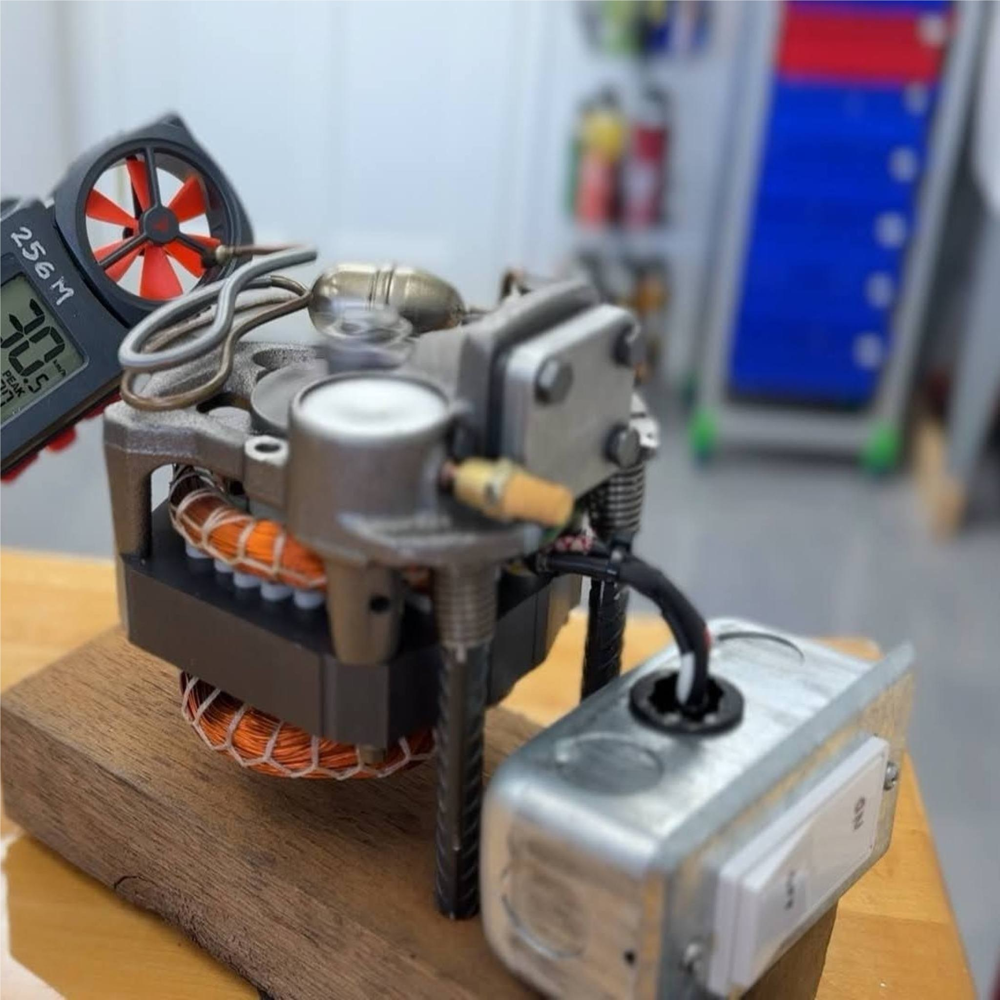
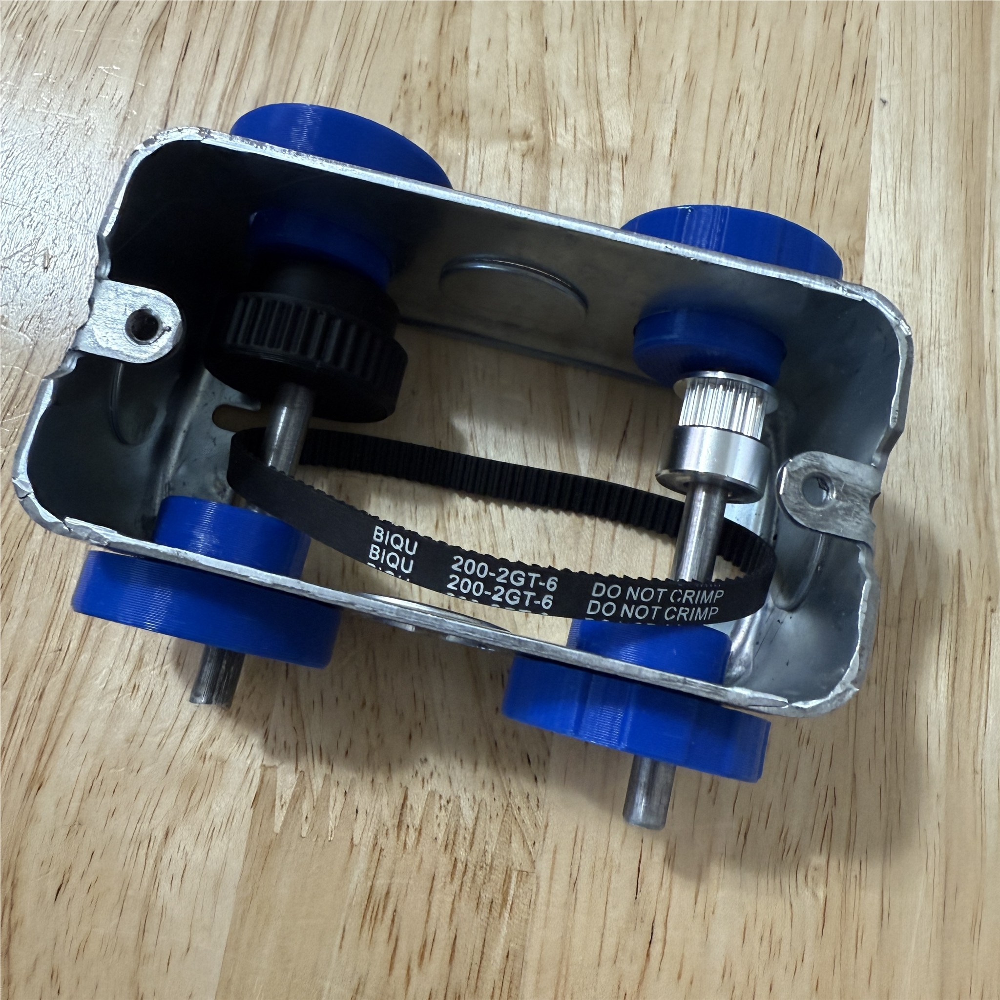
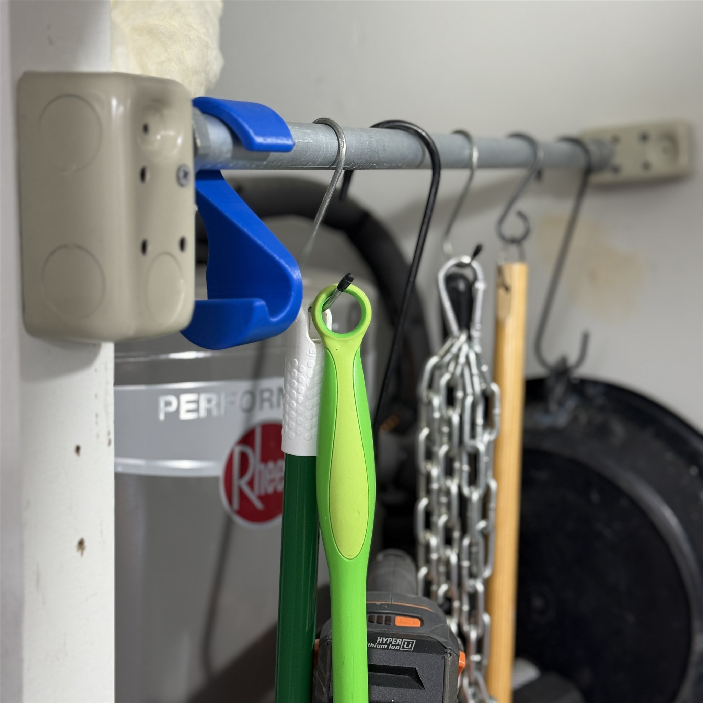
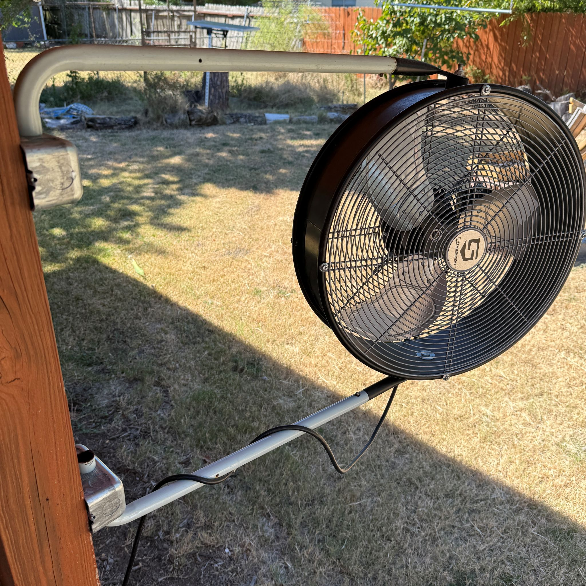
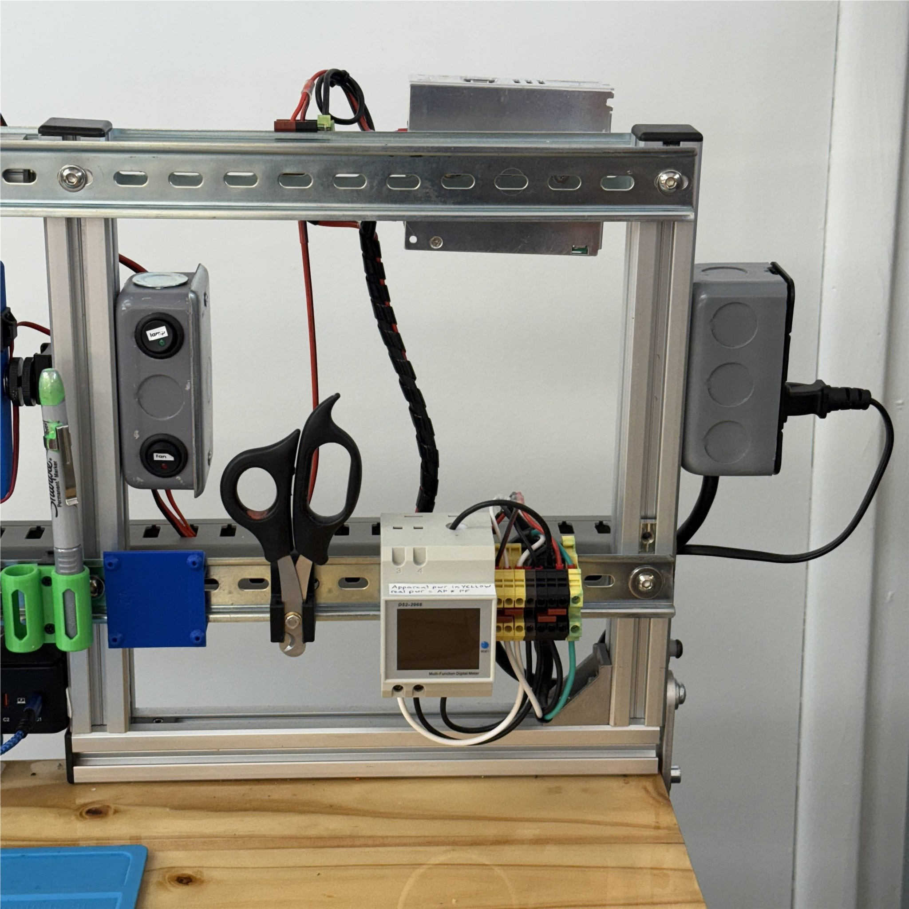

Openbox is a collection of inventions based on a "handy box," a cheap standard part found in American hardware stores.  At about $1.80 each, this box can outperform many alternatives for it's thermal properties, rigidity, dead weight, and availability of attachments that don't require any effort at all.  This collection is intended to crack open your imagination, especially for 3D printer enthusiasts who want to create projects that demand stronger components than plain plastic.

# Explore Examples

Don’t like reading? Just hop onto [GrabCAD](https://grabcad.com/library?page=1&time=all_time&sort=recent&query=openbox) to dive straight into the OpenBox designs! Check out the [examples of usages](examples.md) for inspiration—though keep in mind it may showcase only a portion of the available designs.

How do you work with OpenBox? Here's one video lesson, of many to come:

<a class="embedly-card" data-card-controls="0" data-card-align="left" href="https://www.youtube.com/embed/VLrEtrU10ow">Build a DIY power supply for powering electronics</a>

>
> We’re excited to see how you will use OpenBox!
> [Jump To Examples](examples.md)
>

# No Limits.

 The example below is a countertop shaver rack, a use case which exploits several features of the OTS box.  The "handybox" brings value to other designs such as:
* desirable mass, eliminates tipping
* handhed size accomodates common needs
* steel, offers high strength & magnetic function

## Electrical
Suitable 3D printed designs for openBox can enable your electronics projects & build robustness. New modules will be continually released such as button mounts, DIN brackets, and other electrical integrations.

- 
- 
- 

## Mechanical
The heavy steel stamping is a perfect starting point for many mechanical designs. Over time, we will feature static figures such as customizable camera mounts, pivoting structures, attachments for parts storage, and dynamic assemblies (you could even call them robots).

- 
- 
- 

## Interfacing
The OpenBox project is designed to document and standardize specifications for small utility boxes commonly used in various countries. While the 4” x 2” x 1-7/8” (16.5 cubic inches) dimensions serve as a relative standard for the small utility box, specifications can vary depending on manufacturers and regions.

For a detailed overview of brand-specific designs and variations, refer to the [Design Catalog](design.md). This resource compiles technical sheets, dimensional drawings, and reliable documentation from various manufacturere..

>
> [Jump to Designs specifications](design)
>

The catalog also includes PDFs drawings obtained from manufacturing highlighting key mechanical features for enhanced clarity and precision in design adaptation.

- 
- 
- 

## Contribute

How can you contribute? We’re here to spark ideas, not dictate outcomes. Share your creations on platforms like [GrabCad](https://grabcad.com/library?page=1&time=all_time&sort=recent&query=openbox), Printables, or others, and help expand the OpenBox project.

Join us on [GitHub](https://github.com/davidmalawey/openBox) for documentation, feedback, or collaboration, and check out related content on [YouTube]](https://www.youtube.com/@davidmalawey)) for inspiration.

Let’s grow this project together and support makers worldwide!

**Docsify-This**
This web page was made possible by DocsifyThis, a free and open web tool that helps authors publish documentation.  I discovered DocsifyThis in 2024 and it now enables all my Github repositories to render into simple web pages.  Learn more at [docsify-this.net](https://docsify-this.net/#/) and get support on discord at [the docsify-this discord](https://discord.gg/docsify) thanks to developer Paul Hibbits!
